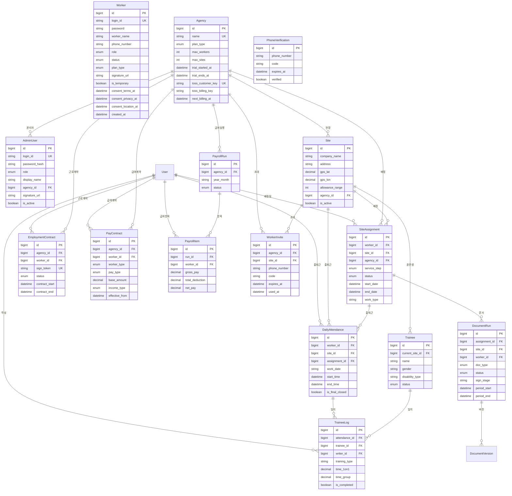

# ERD (Entity Relationship Diagram)

> Prisma schema 기반으로 자동 생성. DB 테이블명은 snake_case, 모델명은 PascalCase.

---

## 핵심 관계 다이어그램

---

## 테이블 목록

| 테이블 | 설명 | 주요 관계 |
|--------|------|----------|
| `users` | 직무지도원 계정 | Agency ← SiteAssignment |
| `agencies` | 에이전시 (구독 단위) | AdminUser, Site, PayrollRun |
| `admin_users` | 관리자 계정 | Agency (agencyId FK) |
| `sites` | 사업체/현장 | Agency, SiteAssignment |
| `site_assignments` | 직무지도원-현장 배정 | User, Site, Agency |
| `daily_attendances` | 일별 출퇴근 기록 | SiteAssignment (Cascade) |
| `trainees` | 훈련생 | Site |
| `trainee_logs` | 훈련일지 | DailyAttendance, Trainee |
| `trainee_log_tasks` | 일지별 과업 | TraineeLog (Cascade) |
| `trainee_placements` | 훈련생-현장 배치 이력 | Trainee, Site |
| `trainee_evaluations` | 훈련생 종합평가 | Trainee, User |
| `employment_contracts` | 근로계약서 | Agency, User |
| `document_runs` | 문서 제출 사이클 | SiteAssignment (Cascade) |
| `document_versions` | 문서 버전 (PDF) | DocumentRun |
| `document_submission_logs` | 문서 발송 이력 | DocumentRun, DocumentVersion |
| `pay_contracts` | 급여 계약 | Agency, User |
| `payroll_runs` | 월별 급여 계산 실행 | Agency |
| `payroll_items` | 개인별 급여 항목 | PayrollRun, User |
| `agency_deductions` | 에이전시 커스텀 공제 | Agency |
| `insurance_rates` | 연도별 4대보험 요율 | - |
| `site_base_points` | 현장 GPS 기준점 | Site |
| `site_holidays` | 커스텀 휴무일 | SiteAssignment |
| `site_sign_tokens` | 사업체담당자 서명 토큰 | SiteAssignment |
| `attendance_issues` | 근태 이슈 | DailyAttendance (1:1) |
| `attendance_issue_events` | 근태 이슈 이벤트 이력 | AttendanceIssue |
| `worker_invites` | 직무지도원 초대 링크 | Agency, Site |
| `phone_verifications` | 전화번호 OTP 인증 | - |
| `worker_notification_settings` | 알람 설정 | Worker (1:1) |
| `submission_requests` | 문서 제출 요청 | SiteAssignment |
| `audit_events` | 감사 로그 | - |
| `common_codes` | 공통 코드 | - |

---

## 주요 Enum

| Enum | 값 |
|------|---|
| `AgencyPlanType` | FREE, TRIAL, STARTER, STANDARD, PRO |
| `AdminRole` | ADMIN, GOV, AGENCY |
| `WorkerRole` | ADMIN, WORKER |
| `WorkerStatus` | ACTIVE, RESIGNED, PAUSED |
| `AssignStatus` | ACTIVE, ENDED, ASSIGNED, CONFIRMED, REJECTED, DROPPED |
| `ServiceStep` | PRE_TRAINING, FIELD_TRAINING, ADAPTATION |
| `DocumentType` | ATTENDANCE_SHEET, TRAINING_DAILY_LOG, TRAINEE_COMPREHENSIVE_EVAL, POST_EMPLOY_ADAPT_LOG, ADAPTATION_COMPREHENSIVE_EVAL, CHECKLIST |
| `PayType` | MONTHLY, DAILY, HOURLY |
| `IncomeType` | BUSINESS (사업소득 3.3%), EMPLOYMENT (근로소득 4대보험) |
| `WorkerType` | INTERNAL (소속직원), EXTERNAL (프리랜서) |
| `ContractStatus` | PENDING, SIGNED, COMPLETED, CANCELLED |
